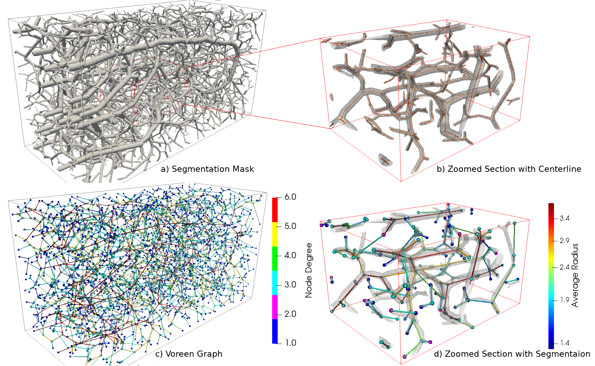

## Introduction
Welcome to the project page of *DeepVesselGraph*  A Dataset and Benchmark for Graph Learning and Neuroscience.  

Biological neural networks define human and mammalian brain function and intelligence and form ultra-large, spatial, structured graphs. Their neuronal organization is closely interconnected with the spatial organization of the brain's microvasculature, which supplies oxygen to the neurons and builds a complementary spatial graph. In this project we are providing an extendable dataset of whole-brain vessel graphs based on various multi-center imaging protocols. 

This new dataset paves a pathway towards translating advanced graph learning research into the field of neuroscience. Complementarily, the new dataset raises challenging graph learning research questions for the machine learning community, for example how to incorporate biological priors in a meaningful and interpretable way into learning algorithms. 

## Features
- *Whole brain vessel graphs:* are the key for research questions to Biology and Neuroscience, including Neuronal organisation, stroke modeling and hemodynamics
- *Ready-to use and large set of data:* We are providing whole brain graphs from different research groups and will
- *Data-Loaders:* We are providing extensive functions to readily process our data for machine learning research, including the community standard OGB and pyG dataloaders
- *Benchmarks:* We benchmarked a comprehensive set of state of the art methods in link prediction and node classification; we provide all codes and detailed instructions
- *Open-source, “living” initiative:* VesselGraph is an open source initiative. We want to expand our datasets as soon as other brain imaging becomes publicly available

## Table of contents

* [Datasets](#dataset-instruction)
* [Baselines](#baseline-instruction)
* [Biological Context](#bio)

## Dataset Instruction
#### 1. Generate Raw Graph fron Segmentation using Voreen
Use [Voreen Graph Generation Tool](https://github.com/jqmcginnis/voreen) to make the `node_list` and `edge_list` from a segmentation volume.

#### 2. Preprocess Dataset

Go to `./source/dataset_preprocessing/` and run `process_edge_list.py` with arguments of `--node_list` and `--edge_list`

#### Download Dataset
|Dataset Name | Unprocessed | Preprocessed |
|-----|-------------|--------------|
|BALBc_no1|[download]() |[download](https://syncandshare.lrz.de/dl/fiG21AiiCJE6mVRo6tUsNp4N/BALBc_no1.zip) |
|BALBc_no2 |[download]() |[download](https://syncandshare.lrz.de/dl/fiS6KM5NvGKfLFrjiCzQh1X1/BALBc_no2.zip) |
BALBc_no3 |[download]() |[download](https://syncandshare.lrz.de/dl/fiD9e98baTK3FWC9iPhLQWd8/BALBc_no3.zip) |
C57BL_6_no1  |[download]() |[download](https://syncandshare.lrz.de/dl/fiVTuLxJeLrqyWdMBy5BGrug/C57BL_6_no1.zip) |
C57BL_6_no2  |[download]() |[download](https://syncandshare.lrz.de/dl/fiNFpZd5S9NYvUYzNwLgf5gW/C57BL_6_no2.zip) |
C57BL_6_no3  |[download]() |[download](https://syncandshare.lrz.de/dl/fi3Z62oab67735GLQXZyd2Wd/C57BL_6_no3.zip) |
CD1-E_no1 |[download]() |[download](https://syncandshare.lrz.de/dl/fiQs4v6kXvGBviqnuT7BAxjK/CD1-E_no1.zip) |
CD1-E_no2 |[download]() |[download](https://syncandshare.lrz.de/dl/fiJf6ukkGCdUQwXBKd4Leusp/CD1-E_no2.zip) |
CD1-E_no3 |[download]() |[download](https://syncandshare.lrz.de/dl/fiBkjGNxm7XW5R4gFTWp5MFP/CD1-E_no3.zip) |
<!-- 
C57BL/6-K18 |[download]() |[download](https://syncandshare.lrz.de/dl/fiG21AiiCJE6mVRo6tUsNp4N/BALBc_no1.zip) |
C57BL/6-K19 |[download]() |[download](https://syncandshare.lrz.de/dl/fiG21AiiCJE6mVRo6tUsNp4N/BALBc_no1.zip) |
C57BL/6-K20 |[download]() |[download](https://syncandshare.lrz.de/dl/fiG21AiiCJE6mVRo6tUsNp4N/BALBc_no1.zip) |
Synth. Graph 1 |[download]() |[download](https://syncandshare.lrz.de/dl/fiG21AiiCJE6mVRo6tUsNp4N/BALBc_no1.zip) |
Synth. Graph 2 |[download]() |[download](https://syncandshare.lrz.de/dl/fiG21AiiCJE6mVRo6tUsNp4N/BALBc_no1.zip) |
Synth. Graph 3 |[download]() |[download](https://syncandshare.lrz.de/dl/fiG21AiiCJE6mVRo6tUsNp4N/BALBc_no1.zip) |
Synth. Graph 4 |[download]() |[download](https://syncandshare.lrz.de/dl/fiG21AiiCJE6mVRo6tUsNp4N/BALBc_no1.zip) |
Synth. Graph 5 |[download]() |[download](https://syncandshare.lrz.de/dl/fiG21AiiCJE6mVRo6tUsNp4N/BALBc_no1.zip) | -->

#### 3. Generate Atlas features (skipped for now)
Got to `./source/feature_generation/atlas_annotation/` and run `generate_node_atlas_labels.py` with arguments of `--node_list` and `--edge_list`
#### 4. Convert to Pytorch-Geometric Dataloader
Got to `./source/pytorch_dataset/` and run `link_dataset.py` and `node_dataset.py` to create pytorch-geometric compatible dataset for link-rediction and node-classification task.
#### 5. Convert to OGB Dataloader
Got to `./source/ogb_dataset/link_prediction/` and run `python3 generate_ogbl_dataset.py` with argument `--dataset` from the list of `Dataset Name` in the table above and `--splitting_strategy` either `random` or `spatial`

Subsequently run `update_ogbl_master.sh` for compileing the ogb repository locally

Go to `./source/ogb_dataset/node_classification/` and run `python3 generate_ogbl_dataset.py` with argument `--dataset` from the list of `Dataset Name` in the table above

We use the following options

Enter indices of desired features (Use "," to separate them): 0,1,2
Enter feature index of desired label: 4
Choose between a certain number of balanced classes (bc) or define classes by pixel boundaries (pb): pb
Enter desired radius boundaries as pixel values (Use "," to separate them): 5,13.33

Subsequently run `update_ogbn_master.sh` for node-classification task.
## Baseline Instruction

#### 1. Link Prediction task

#### 2. Node Classificatio task

## Contribute 

We are a living and continously maintained repository! Therefore, we welcome contributions of additional datasets and methods! There is multiple ways to contribute; if you are willing to share whole brain segmentations and graphs .... 

## Reference  
Authors Authors Authors "Whole Brain Vessel Graphs: A Dataset and Benchmark for Graph Learning and Neuroscience (VesselGraph)", [arXiv:XYZ](https://arxiv.org/abs/XYZ)
  
Please cite this work if any of our code or datasets are helpful for your research. Considering the specific graphs, please also cite the respective original datasets as described in the preprint.

## License 

Our project is licensed under the [MIT license](https://github.com/jocpae/VesselGraph/LICENSE).
